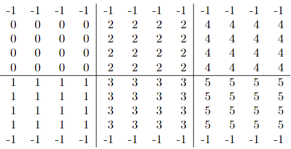

# Advanced-MPI-2D-Decomposition

The purpose of this project is to improve the simple Jacobi iteration method to approximate the solution to a linear system of equations. The basic Jacobi iteration solves the Laplace equation in two dimensions with finite differences. The parallel computing method such as MPI was used in a more complex setup to create more robust algorithms.

A simple Jacobi iteration can be used to approximate the solution to a linear system of equations. In this project, the iteration is used to solve the Laplace equation in two dimensions with finite differences. The numerical computation can be showed with the sudo code below.

```C++
while (not converged) {
        for (i,j)
            xnew[i][j] = (x[i+1][j] + x[i-1][j] + x[i][j+1] + x[i][j-1])/4;
        for (i,j)
            x[i][j] = xnew[i][j];
}
```

The algorithm will compute the approximation by computing the average of the values around a specific point of the mesh. The computation is only applied to the interior of the mesh and the boundary values are left fixed which is also denoted as boundary condition. Once the algorithm iterates through the entire of the interior of the mesh, the new values will be updated for the next iteration. The iteration will stop when the $L^2$ norm is less than $10e^{-2}$.

The Message Passing Interface (MPI) tool is used in this project for parallel computing purposes. The mesh will be divided into multiple portions which will be processed by different processors. Each processor performs the same technique to calculate the $L^2$ norm and uses the MPI\_Allreduce to distribute the reduced value to all processors.

The mesh is set up as follow. The boundary values of the first and last row are $-1$ and the side are the rank number which are kept fixed. The interior values are the same as the rank number. Considering $m = 10$ and $n = 12$ as the number of rows and columns of the mesh respectively and $p = 6$ as the number of processors, the initial data on the given mesh is as below.



For the sake of simplicity, the number of rows of the mesh and the number of processors are even. The mesh is divided into two half. The upper half is assigned to the ranks with even number and ranks with odd number process the lower half. Therefore, the number of columns must be divisible by half of the number of processors. For example, $n = 12$ is divisible by $3$.

For initializing the mesh, since there will be exchanges of rows and columns between the ranks, each sub-mesh is added with two columns on the left and right and one rows at the bottom if the rank's number is even or at the top if it's odd.

Since the outer ranks such as rank 0, 1, 4, and 5 have one less column of interior points, the appropriate starting and stopping points need to be defined. Note that in C++, the first row or column is denoted as 0. If the rank is either 0 or 1, the starting column of the initial step is 1 and every value in column 0 is considered as ghostpoint. Similarly, if the rank is either 4 or 5, the stopping column is 4 instead of 5. Once the starting and stopping points are configured, initial data will be filled in the mesh.

Since each rank relies on the data of the other ranks, we would need to perform the exchanges of rows and columns between them. If current rank is even, it will send the last row of its grid to the rank below which is only 1 rank higher. For example, if the current rank is 0, it will need to pass row 4 to rank 1. For the receivers, they will copy the received row into the first row. On the other hand, if the rank is odd, it will send the second row to the rank above. Similarly, the rank needs to send data to its left or right neighbors. The two most left ranks will only send data to the right and receive data from the right. On the opposite, the two far right ranks will only send and receive data from the left. The inner ranks will send and receive data from both sides. The modified version of the mesh and how the exchanges of rows and columns between the ranks are shown as below.

